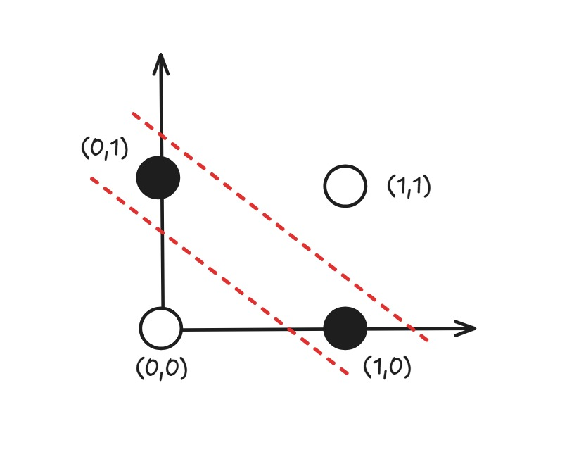
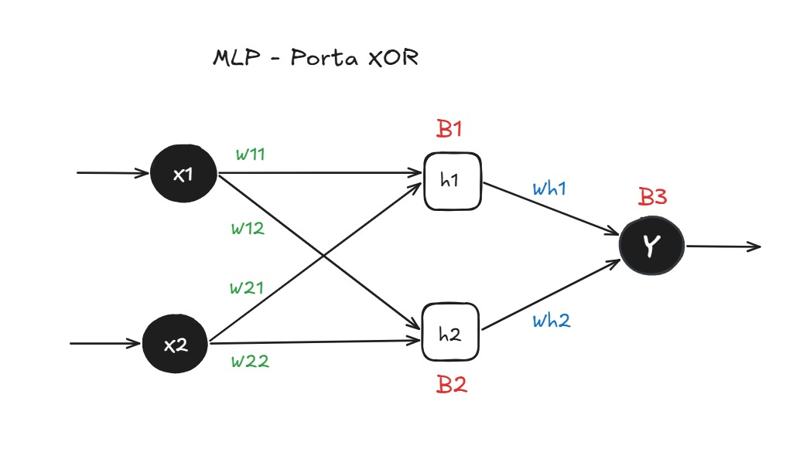

# MLP do Zero — Documentação de Desenvolvimento

## Sumário

1. [Introdução](#1-introdução)
2. [Por que a Porta XOR?](#2-por-que-a-porta-xor)
3. [Arquitetura base — XOR](#3-arquitetura-base--xor)
4. [Desenvolvimento no MLP_XOR](#4-desenvolvimento-no-mlp_xor)
   - [Teste 1 — Implementação base](#41-teste-1--implementação-base)
   - [Teste 2 — Tabela da verdade completa](#42-teste-2--tabela-da-verdade-completa)
   - [Teste 3 — Curva de aprendizado](#43-teste-3--curva-de-aprendizado)
   - [Teste 4 — Efeito do alpha e das épocas](#44-teste-4--efeito-do-alpha-e-das-épocas)
   - [Teste 5 — Refatoração para matrizes](#45-teste-5--refatoração-para-matrizes)
   - [Teste 6 — Efeito do número de neurônios ocultos](#46-teste-6--efeito-do-número-de-neurônios-ocultos)
   - [Teste 7 — Múltiplas camadas ocultas](#47-teste-7--múltiplas-camadas-ocultas)
   - [Teste 8 — Sigmoid vs ReLU](#48-teste-8--sigmoid-vs-relu)
   - [Teste 9 — Inicialização de pesos](#49-teste-9--inicialização-de-pesos)
5. [Quantos neurônios e camadas ocultas usar?](#5-quantos-neurônios-e-camadas-ocultas-usar)
6. [Do XOR para o MNIST](#6-do-xor-para-o-mnist)
7. [Resultados](#7-resultados)
8. [Decisões e Dificuldades](#8-decisões-e-dificuldades)


## 1. Introdução

Realizei o desenvolvimento em dois notebooks diferentes que serviram para meu processo de aprendizado. O `MLP_XOR` contém os fundamentos de desenvolvimento de funções usando apenas NumPy que serão utilizados como base e, em alguns casos, diretamente reutilizados no `MLP_MNIST` (notebook da ponderada em si). Os dois foram desenvolvidos no Google Colab.

A ideia de começar pelo XOR veio de uma sugestão do próprio enunciado da ponderada: começar pelo caso mais simples antes de escalar. Fui seguindo isso e cada teste que adicionei ao XOR surgiu de uma dúvida real que apareceu no caminho.


## 2. Por que a Porta XOR?

O XOR é o problema mais simples que um perceptron de camada única não consegue resolver. Qualquer função linear separável, como AND ou OR, um único neurônio resolve. O XOR não, porque os pontos que resultam em 1 e os que resultam em 0 não podem ser separados por uma reta.

<div align="center">
    <strong style="font-size: 18px;"><sub>Não Lineariedade</sub></strong><br>
<br>
    <sup>Fonte: Desenvolvido Através do Excalidraw</sup>
  </div>

Olhando o gráfico, `(0,1)` e `(1,0)` precisam ser classe 1, e `(0,0)` e `(1,1)` precisam ser classe 0. Não existe uma reta que faça isso. Qualquer reta que separe `(0,1)` de `(0,0)` vai misturar `(1,0)` e `(1,1)` no lado errado.

Isso força a rede a ter pelo menos uma camada oculta com uma função de ativação não-linear, que é exatamente o que a ponderada exige. Então o XOR é pequeno o suficiente para eu depurar manualmente, mas já exige tudo que vai ser necessário no MNIST.


## 3. Arquitetura base — XOR

A arquitetura inicial é a mais simples possível para resolver o XOR: duas entradas, uma camada oculta com dois neurônios e uma saída.

<div align="center">
    <strong style="font-size: 18px;"><sub>Arquitetura MLP para Porta XOR</sub></strong><br>
<br>
    <sup>Fonte: Desenvolvido Através do Excalidraw</sup>
  </div>

Cada entrada $x_1$ e $x_2$ se conecta a ambos os neurônios ocultos $h_1$ e $h_2$ com pesos independentes. Os biases $B_1$, $B_2$ e $B_3$ permitem que cada neurônio desloque sua função de ativação.

**Forward pass** de $h_1$ como exemplo:

$$h_1 = \sigma(w_{11} \cdot x_1 + w_{12} \cdot x_2 + B_1)$$

E a saída:

$$\hat{y} = \sigma(wh_1 \cdot h_1 + wh_2 \cdot h_2 + B_3)$$

Onde $\sigma$ é a sigmoid:

$$\sigma(z) = \frac{1}{1 + e^{-z}}$$

A sigmoid foi escolhida para o XOR porque transforma qualquer valor real em um número entre 0 e 1, o que faz sentido para uma saída binária. Nos testes mais à frente vou mostrar por que ela não é a melhor escolha para camadas ocultas quando a rede cresce.


## 4. Desenvolvimento no MLP_XOR

### 4.1 Teste 1 — Implementação base

A primeira versão da rede usa variáveis individuais para cada peso (`w11`, `w12`, `w21`, `w22`, `wh1`, `wh2`) e biases escalares. Cada nome de variável corresponde diretamente a uma conexão do diagrama, o que ajuda a entender o que está acontecendo.

O **backpropagation** calcula o gradiente da loss em relação a cada peso usando a regra da cadeia. Para o peso $w_{11}$:

$$\frac{\partial L}{\partial w_{11}} = \frac{\partial L}{\partial \hat{y}} \cdot \frac{\partial \hat{y}}{\partial h_1} \cdot \frac{\partial h_1}{\partial w_{11}}$$

Desenvolvendo cada termo com MSE como loss:

$$\frac{\partial L}{\partial \hat{y}} = -(y - \hat{y})$$

$$\frac{\partial \hat{y}}{\partial h_1} = \sigma'(\hat{y}) \cdot wh_1 = \hat{y}(1-\hat{y}) \cdot wh_1$$

$$\frac{\partial h_1}{\partial w_{11}} = \sigma'(h_1) \cdot x_1 = h_1(1-h_1) \cdot x_1$$

No código isso ficou como:

```python
derivative_y  = y  * (1 - y)  * error
derivative_h1 = h1 * (1 - h1) * wh1 * derivative_y
delta_w11     = alpha * derivative_h1 * inputs[j][0]
```

A limitação dessa versão é que ela não escala. Se eu quisesse 10 neurônios ocultos, precisaria de 20 variáveis de peso só para a primeira camada.

### 4.2 Teste 2 — Tabela da verdade completa

No Teste 1 eu só verificava a predição para `[1, 1]`. Adicionei um loop que percorre as quatro entradas e compara o esperado com o predito. Isso parece óbvio, mas foi necessário porque a inicialização aleatória dos pesos faz a rede às vezes acertar `[1,1]` por sorte e errar os outros.

### 4.3 Teste 3 — Curva de aprendizado

Adicionei `historico_loss` ao loop de treinamento para guardar o MSE médio ao final de cada época e plotar a curva de aprendizado.

O MSE é calculado como:

$$MSE = \frac{1}{n} \sum_{i=1}^{n} (y_i - \hat{y}_i)^2$$

A curva é o que permite ver se o treinamento foi estável, se oscilou, ou se a rede ficou presa. Sem ela eu só sei o resultado final, não o que aconteceu no meio.

### 4.4 Teste 4 — Efeito do alpha e das épocas

Testei cinco combinações de `alpha` e número de épocas para entender o efeito de cada um.

A atualização de pesos por SGD é:

$$w \leftarrow w + \alpha \cdot \delta$$

Com `alpha` muito alto, o passo de atualização é grande demais e a rede "pula" o mínimo da loss. Com `alpha` muito baixo, a convergência existe mas é lenta. Épocas insuficientes interrompem o treino antes de convergir.

A configuração `alpha=0.1` e `epochs=10000` do Teste 1 virou o ponto de referência porque funcionou. Os outros experimentos ajudaram a entender por que.

### 4.5 Teste 5 — Refatoração para matrizes

Essa é a mudança mais importante do notebook XOR. Substituí as variáveis individuais por matrizes NumPy:

$$\mathbf{W_1} \in \mathbb{R}^{n_{ocultos} \times n_{entradas}}, \quad \mathbf{b_1} \in \mathbb{R}^{n_{ocultos} \times 1}$$

Com isso, o forward pass de uma camada inteira vira uma multiplicação matricial:

$$\mathbf{z_1} = \mathbf{W_1} \cdot \mathbf{x} + \mathbf{b_1}$$
$$\mathbf{h} = \sigma(\mathbf{z_1})$$

E o gradiente de $\mathbf{W_1}$ no backprop:

$$\frac{\partial L}{\partial \mathbf{W_1}} = \boldsymbol{\delta}_1 \cdot \mathbf{x}^T$$

Onde $\boldsymbol{\delta}_1$ é o gradiente propagado da camada seguinte:

$$\boldsymbol{\delta}_1 = \sigma'(\mathbf{h}) \odot (\mathbf{W_2}^T \cdot \boldsymbol{\delta}_2)$$

Sem essa refatoração seria inviável implementar o MNIST com 784 entradas. Passando `n_ocultos=2` a `MLPModular` reproduz exatamente o Teste 1.

### 4.6 Teste 6 — Efeito do número de neurônios ocultos

Com a `MLPModular` ficou fácil testar `n_ocultos` em `[1, 2, 4, 8]` sem reescrever nada.

Com 1 neurônio oculto a rede às vezes não converge porque a capacidade de representação pode não ser suficiente para o XOR. Com 2 já funciona na maioria das inicializações. Com 4 e 8 a rede converge, mas os neurônios extras ficam redundantes para um problema tão simples.

Isso é importante para o MNIST porque lá a escolha do número de neurônios tem impacto direto na acurácia e no overfitting.

### 4.7 Teste 7 — Múltiplas camadas ocultas

A `MLPModular` tem uma camada oculta fixa. A ponderada exige pelo menos duas. Então refatorei para `MLPProfunda`, que recebe uma lista de tamanhos de camadas, por exemplo `[2, 4, 4, 1]`.

A inicialização cria uma lista de pares $(W_k, b_k)$, um por camada de conexão. O forward pass percorre essa lista em sequência, salvando todas as ativações intermediárias porque o backprop vai precisar delas.

O backprop em loop reverso propaga o gradiente da saída até a entrada:

$$\boldsymbol{\delta}_k = \sigma'(\mathbf{a}_k) \odot (\mathbf{W}_{k+1}^T \cdot \boldsymbol{\delta}_{k+1})$$

$$\Delta \mathbf{W}_k = \alpha \cdot \boldsymbol{\delta}_k \cdot \mathbf{a}_{k-1}^T$$

Essa estrutura é diretamente reutilizada no MNIST.

### 4.8 Teste 8 — Sigmoid vs ReLU

A sigmoid tem um problema em redes mais profundas. Sua derivada:

$$\sigma'(z) = \sigma(z)(1 - \sigma(z))$$

tem valor máximo de $0.25$ (em $z=0$) e se aproxima de zero para valores grandes ou pequenos de $z$. Ao multiplicar esses gradientes em várias camadas durante o backprop, o sinal de erro encolhe exponencialmente — isso se chama **vanishing gradient**.

A ReLU resolve isso para valores positivos:

$$\text{ReLU}(z) = \max(0, z), \quad \text{ReLU}'(z) = \begin{cases} 1 & z > 0 \\ 0 & z \leq 0 \end{cases}$$

Derivada 1 significa que o gradiente não encolhe ao passar pela camada. Para o XOR com uma camada oculta a diferença é pequena, mas para o MNIST com duas camadas e 784 entradas a ReLU converge mais rápido e de forma mais estável.

A implementação no código é `np.maximum(0, z)` para o forward e `(a > 0).astype(float)` para a derivada.

### 4.9 Teste 9 — Inicialização de pesos

Nos testes anteriores usei `np.random.uniform(0, 1)`. Todos os pesos positivos saturavam a sigmoid no início do treinamento, os gradientes ficavam perto de zero nas primeiras épocas e a convergência era mais lenta.

Testei três esquemas:

**`uniform(0, 1)`** — viés positivo, satura a sigmoid.

**`uniform(-1, 1)`** — simétrico, mais equilibrado.

**Xavier (Glorot)** — escala os pesos pelo número de entradas da camada para manter a variância dos gradientes estável:

$$W \sim \mathcal{U}\left(-\sqrt{\frac{1}{n_{in}}},\ \sqrt{\frac{1}{n_{in}}}\right)$$

A intuição é que se os pesos forem muito grandes, as ativações explodem; se forem muito pequenos, o gradiente desaparece. Xavier encontra um equilíbrio baseado no tamanho da camada.

Para o MNIST com ReLU existe uma variante chamada He initialization que usa $\sqrt{2/n_{in}}$ no lugar de $\sqrt{1/n_{in}}$, pensada especificamente para a ReLU. Vou adotar Xavier por ora e verificar empiricamente.


## 5. Quantos neurônios e camadas ocultas usar?

Perguntei isso diretamente ao professor em sala. A resposta foi: **"Nãoão existe uma teoria exatamente fundamentada que responda essa questão."**

Achei a resposta honesta e fui pesquisar o que existe na prática.

Não existe uma fórmula. O que existe são heurísticas que a comunidade foi consolidando ao longo do tempo.

Uma delas é que o número de neurônios em uma camada oculta costuma funcionar bem quando está entre o tamanho da entrada e o tamanho da saída. Para o MNIST, 784 entradas, 10 saídas. Uma camada com 128 ou 256 está nesse intervalo.

Outra é a ideia de redução progressiva, cada camada comprime a representação gradualmente antes de chegar à saída. Uma arquitetura `784 → 256 → 128 → 10` segue essa lógica.

Mais neurônios aumentam a capacidade de representação, mas também aumentam o número de parâmetros e o risco de overfitting. O MNIST tem 60.000 exemplos de treino, então arquiteturas muito grandes tendem a memorizar em vez de generalizar. Por outro lado, adicionar camadas não é de graça: camadas muito profundas com camadas estreitas sofrem de vanishing gradient nas primeiras camadas, mesmo com ReLU.

A arquitetura que vou testar no MNIST:

```
784 → 256 (ReLU) → 128 (ReLU) → 10 (softmax)
```

Essa escolha não veio de uma fórmula. Veio das heurísticas acima e do que encontrei de referência para MNIST com SGD. Vai ser testada empiricamente e ajustada se necessário.


## 6. Do XOR para o MNIST

O que muda estruturalmente do XOR para o MNIST:

**Entrada:** cada imagem 28×28 é achatada em um vetor de 784 valores e normalizada entre 0 e 1.

**Saída multiclasse:** a camada de saída usa softmax em vez de sigmoid. O softmax transforma os 10 valores de saída em uma distribuição de probabilidade:

$$\text{softmax}(z_i) = \frac{e^{z_i}}{\sum_{j=1}^{10} e^{z_j}}$$

**Função de perda:** a cross-entropy substitui o MSE porque é mais adequada para saídas de probabilidade:

$$L = -\sum_{i=1}^{10} y_i \log(\hat{y}_i)$$

O gradiente da combinação softmax + cross-entropy tem uma forma simplificada que facilita o backprop:

$$\frac{\partial L}{\partial z_i} = \hat{y}_i - y_i$$

Isso significa que o delta da camada de saída é simplesmente `predito - esperado`, sem precisar calcular a derivada do softmax separadamente.

**Mini-batches:** no XOR eu atualizava os pesos após cada exemplo (SGD online). No MNIST vou agrupar os exemplos em batches de tamanho fixo e atualizar uma vez por batch com o gradiente médio. Isso torna o treinamento mais estável e computacionalmente mais eficiente.

O restante da estrutura, a lista de camadas, o loop de backprop reverso, a inicialização Xavier, vem diretamente do Teste 7 do XOR.


## 7. Resultados

*(a preencher após o treinamento do MLP_MNIST)*

| Configuração | Camadas ocultas | Neurônios | Alpha | Épocas | Acurácia teste |
|---|---|---|---|---|---|
| Config A | 2 | 256, 128 | 0.01 | 30 | — |
| Config B | 2 | 128, 64 | 0.01 | 30 | — |


## 8. Decisões e Dificuldades

**A decisão técnica mais difícil** foi a refatoração do Teste 5. Enquanto o código com variáveis nomeadas (`w11`, `w12`...) era fácil de rastrear linha por linha, a versão matricial exigiu pensar nos pesos como um objeto único por camada. Os erros de shape, `(n_saidas, n_entradas)` vs `(n_entradas, n_saidas)`, causaram erros de multiplicação matricial que levaram um tempo para depurar. A decisão de manter a refatoração foi necessária porque sem ela o MNIST seria inviável.

**O que não funcionou:** a inicialização com `uniform(0, 1)` foi o problema mais lento de identificar. A rede treinava e convergia, então não havia erro explícito, mas a convergência era mais lenta do que deveria e algumas inicializações levavam a uma loss que ficava alta por muitas épocas antes de começar a cair. Só ao testar `uniform(-1, 1)` e depois Xavier ficou claro que a inicialização positiva estava causando saturação inicial da sigmoid.

**O que faria diferente:** começaria o notebook XOR já com a arquitetura baseada em matrizes e usaria a versão com variáveis individuais só como explicação nos comentários, não como código funcional. A refatoração do Teste 5 criou inconsistências de interface entre as classes, a `MLPComCurva` e a `MLPModular` têm assinaturas diferentes para `predict`, que tornaram difícil comparar os testes anteriores com os posteriores.
